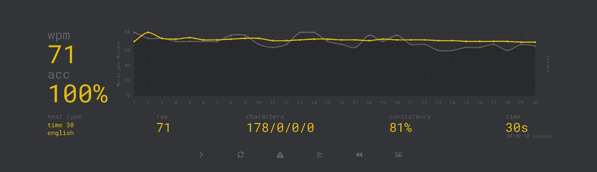

# Type Maestro - Task Completion

I am pleased to share that I have successfully completed the **Type Maestro** task.

## Experience While Learning Touch Typing

At first, learning touch typing was quite challenging. I found myself frequently looking at the keyboard, and my initial speed was slower than expected. However, with consistent practice using [typing.com](https://www.typing.com/), I gradually built muscle memory. 

It was a process of patience and persistence—improving a few words per minute each week. The daily practice sessions, even if just for 5-10 minutes, made a noticeable difference over time. I started to feel more comfortable typing without looking at the keyboard, and my posture improved as well.

One key lesson I learned was that it's not just about typing fast, but also typing accurately. Focus on accuracy helped me avoid bad habits and unnecessary mistakes, which eventually led to an improvement in speed.

## Achievement

After several weeks of practice, I was able to reach the target of **60 WPM (Words per Minute)** with **95% accuracy** on [Monkeytype](https://monkeytype.com/). Here is the screenshot of my high score from a 30-second test:

Touch typing has made me more efficient, and I feel more confident in my typing ability now. I'm looking forward to continuing this skill development in the future.

Thank you for the opportunity to work on this task.

